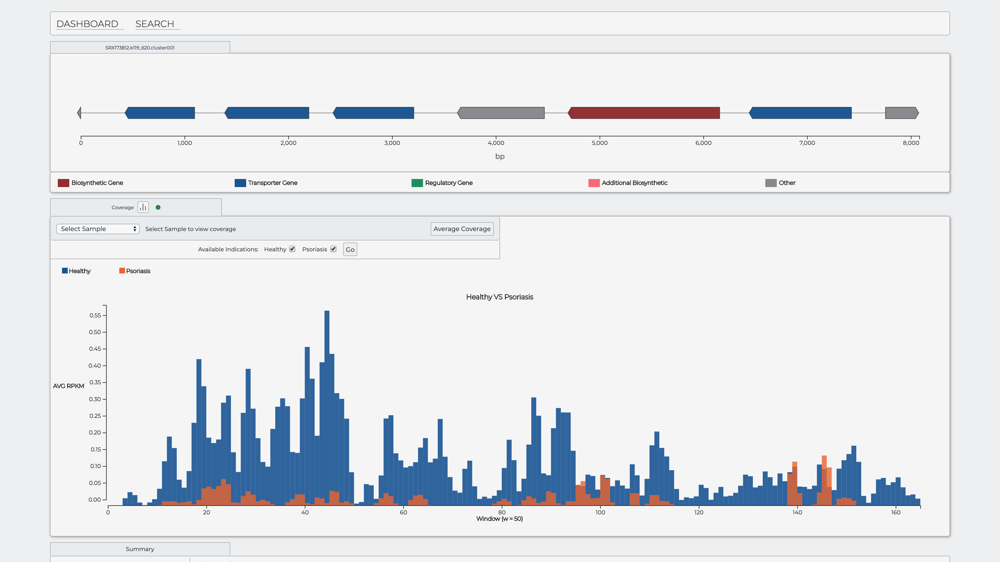
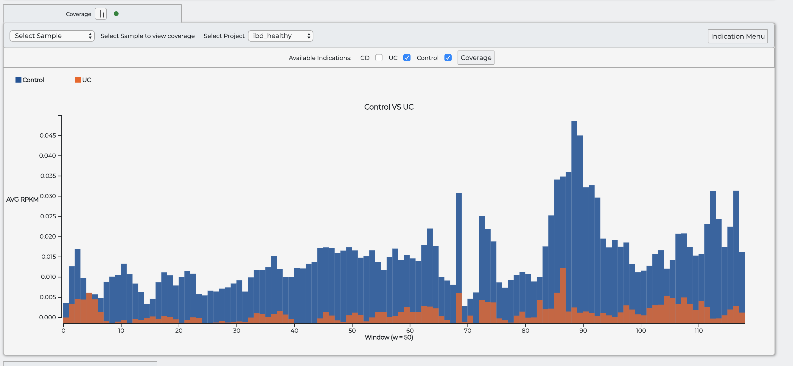
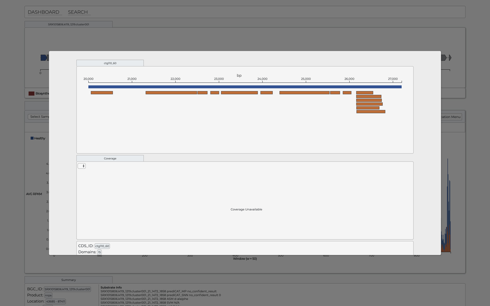
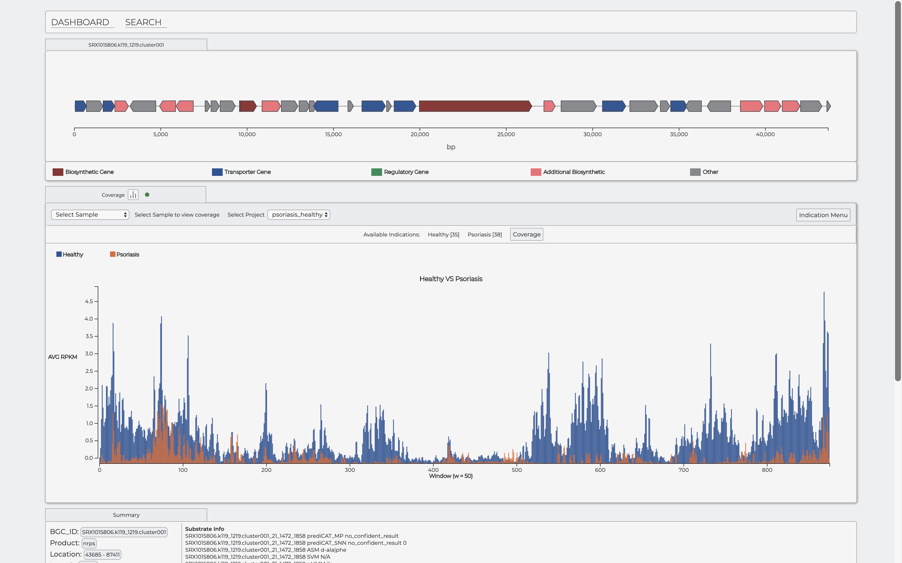
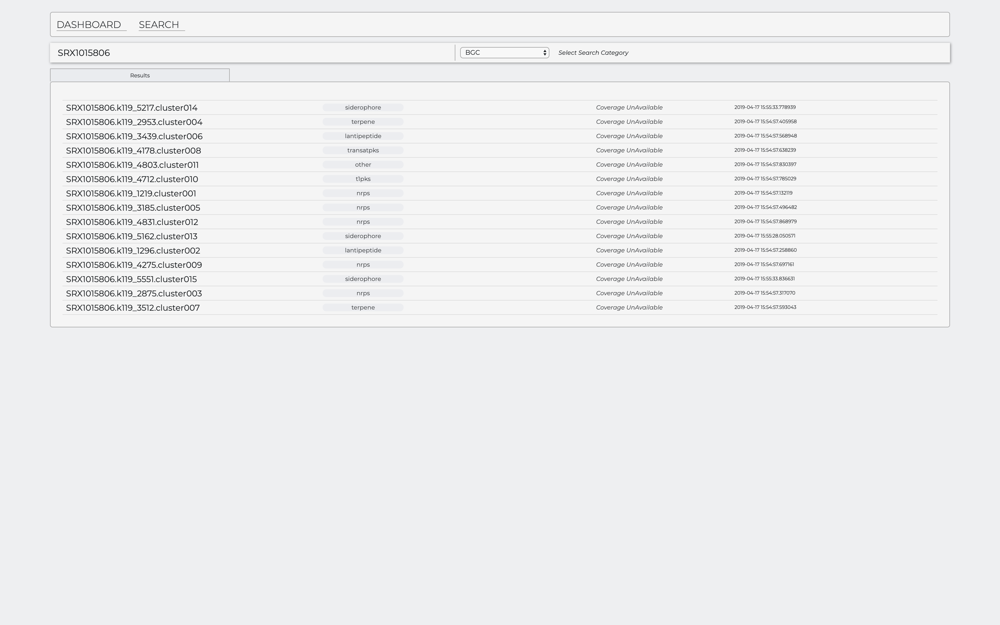
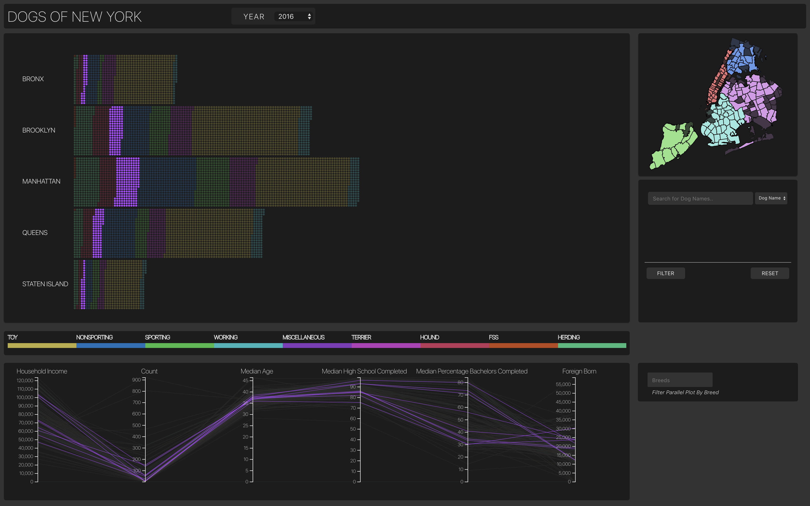
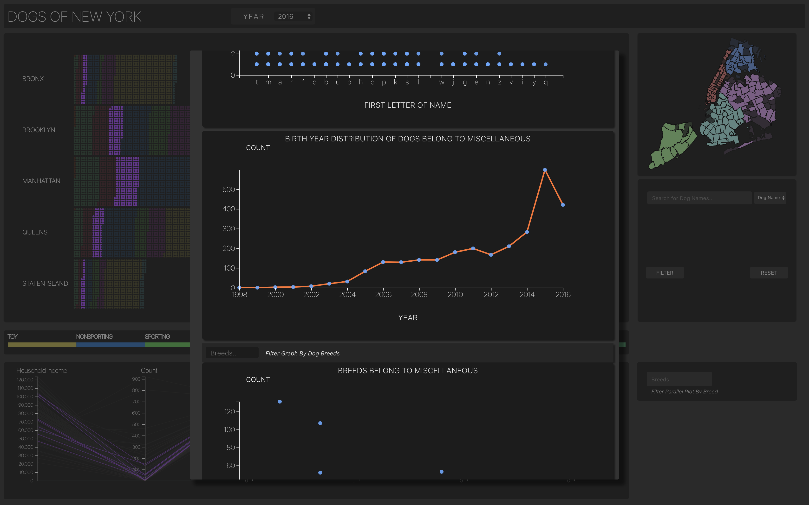
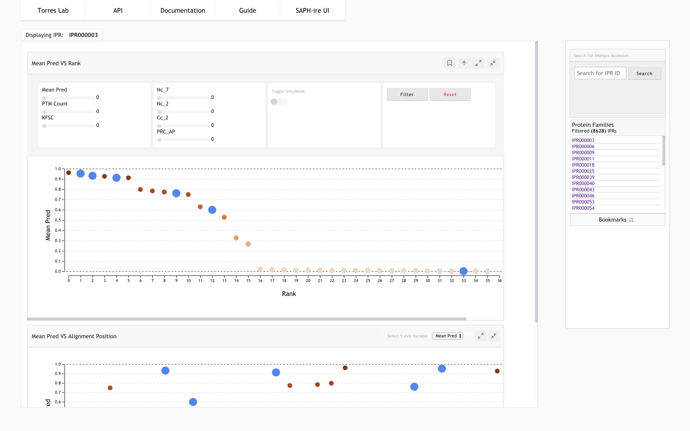
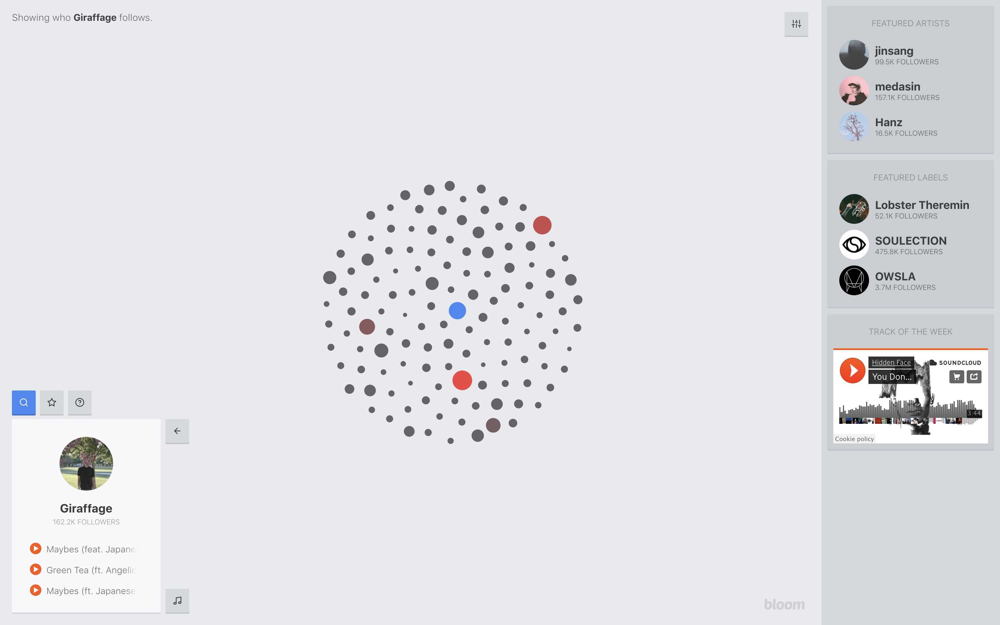
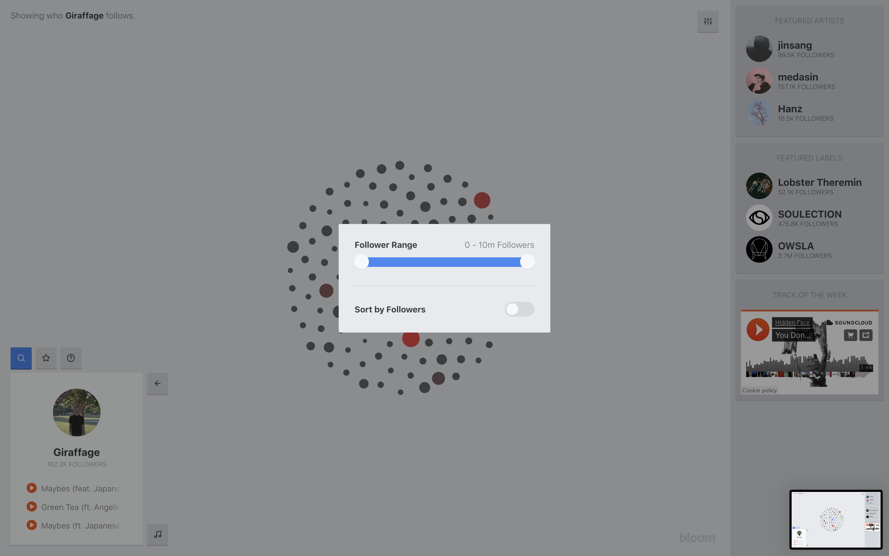

# Data Visualization Portfolio
*****
These are some cool web apps I built for fun with friends and during grad school 
Data Visualization Portfolio in D3 Javascript, all the backend, hosting and REST APIs were also built by me
*****
##### Biosynthetic Gene Cluster Visualization (Backend Django) *one person project* 

##### GA Tech Information Visualization Final Project (Backend Node.js) *team: 3*

##### User interface for SAPHIRE Machine Learning Tool for prioratizing protein Post Translational Modifications

##### Bloommusic: A visual experience to explore new music from artist social networks *Personal Project with Sebastian Wetzel*

